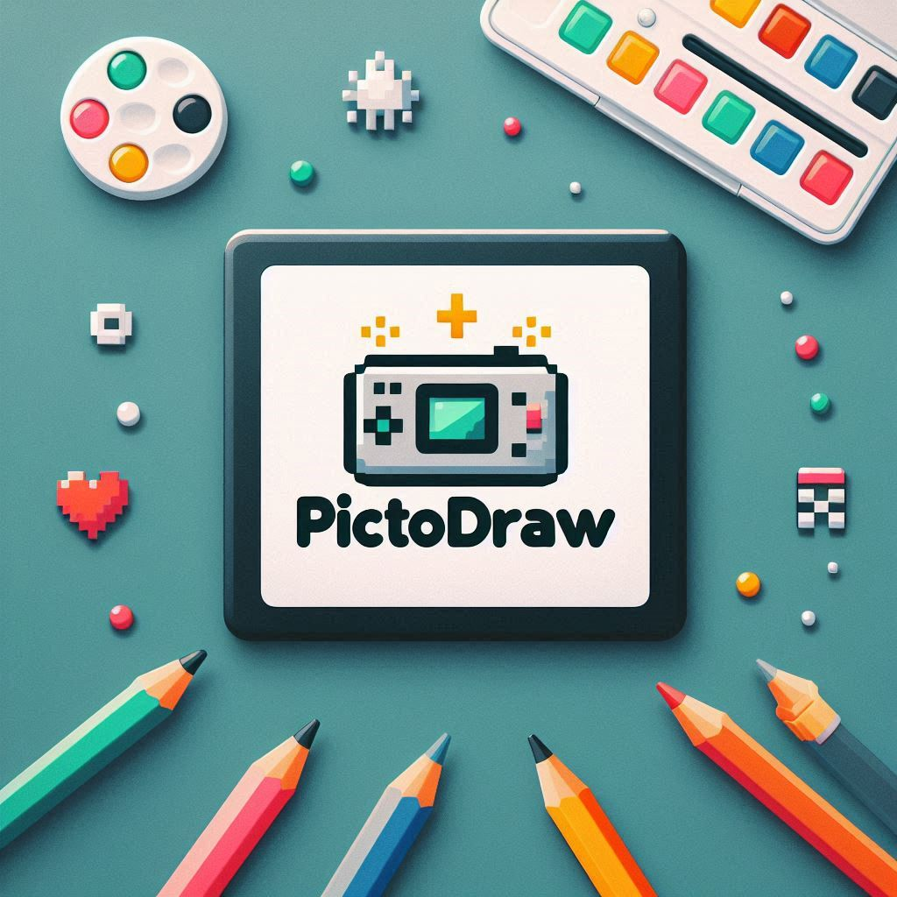

# PictoDraw

  

## 📱 Project Information

PictoDraw is a web application inspired by the classic PictoChat from the Nintendo DS. It allows you to create pixel art drawings and share them in a simulated chat, recreating the nostalgic experience of graphic communication on the Nintendo DS.

## 🎮 Demo

Check out the live demo of PictoDraw [here](https://duccioo.github.io/PictoDraw/).

## ✨ Current Features

- 🎨 Pixel art style drawing canvas
- ✏️ Basic tools: brush and eraser
- 🔄 "Undo" function to correct mistakes
- 🔍 Three selectable brush sizes
- 📝 Five drawing patterns (solid, crosshatch, diagonal, dots, lines)
- 💾 Save drawings with white or transparent background
- 💬 Chat area for displaying sent drawings
- 🧹 Clear the canvas with one click

## 🚀 How to Use

1. Open the `index.html` file in your browser
2. Use the brush to draw on the canvas
3. Choose from different patterns and brush sizes
4. Use the eraser to correct any mistakes
5. Press the "Send" button (arrow icon) to send the drawing to the chat
6. Download your drawings using the buttons at the bottom

## 🔧 Technologies Used

- HTML5 Canvas for drawing
- Vanilla JavaScript for logic
- CSS for the retro Nintendo DS-inspired style

## 🖼️ Drawing Features

- **Tools**: Brush and eraser
- **Patterns**: Solid, crosshatch, diagonal, dots, lines
- **Sizes**: Small (4px), medium (8px), large (12px)
- **Undo**: Undo the last drawing action
- **Save**: Download as PNG with white or transparent background

## 📂 Project Structure

- `chat.html` - Main application file
- `styles.css` - Styles and visual theme of the Nintendo DS
- `script.js` - Drawing and interaction logic

## 🔮 Possible Future Developments

- Addition of more colors besides black
- User login system
- Real-time chat between multiple users
- Customizable themes
- Improved touch device support
- More drawing tools and geometric shapes

## 📝 Notes

This project is currently under development and works best on desktop. Mobile support is being improved.

---

<!-- markdownlint-disable MD033 -->

  
Made with ❤️ by <a href="https://github.com/Duccioo">Duccioo</a> inspired by the nostalgic PictoChat from the Nintendo DS

<!-- markdownlint-enable MD033 -->
